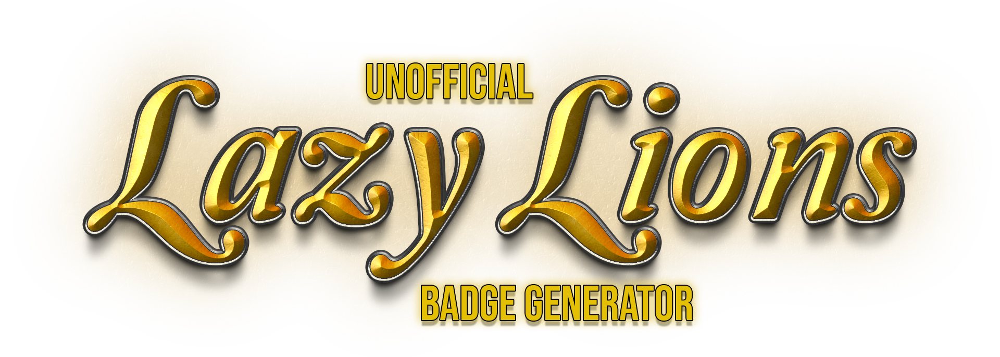

# 🐼 Unofficial Lazy Lion Badge Generator V2

This is a **Progressive Web App (PWA)** that allows users to:

- ✅ Generate a customized badges with your Lion on it  
- ✅ Download and share your badge on social media  
- ✅ Choose from multiple artwork styles  
 

I built this to learn a few things to do with Canvas API and figured I'd share it. I'll probably add more badges along the way. 
 

---

## 🔒 Your Safety Matters

This app **never connects to your wallet** or asks for permissions.  
It simply fetches **public blockchain data** based on the wallet address you enter.  
Your assets and identity stay 100% private.

---

## 🚀 Features

| Feature                  | Description                                                             |
|--------------------------|-------------------------------------------------------------------------|
| 🎨 Badge Style Selector   | Choose from 4 stylish badge templates                                  |
| 🖼️ Downloadable Badge     | Save your badge as a PNG for use on X, Discord, or Telegram            |
| 🐛 Cool wiggle effect     | Badges wiggle upon hovering over them                                  |
| 📱 Eye pleasing UI        | Beautiful glow, subtle colors and a centered mobile-friendly layout     |

### 📋 New in V1 as of 7/5/25

- ✅ Cool Roar sound upon badge reveal  
- More features coming...

---

## Visit The App

[

---

## 🛠️ Powered By

- **HTML5** – Semantic structure  
- **CSS3** – Custom styles, gradients, and animations  
- **JavaScript (ES6+)** – Main app logic and functionality  
- **Canvas API** – Dynamic badge creation and drawing  
- **Alchemy NFT API** – Retrieves Lazy Lions NFT metadata  
- **PWA Tech** – Manifest + service worker = installable app  
- **IPFS Gateway** – Image compatibility via `nftstorage.link`  
- **Google Fonts** – `Merriweather`, `Orbitron`, `Bebas Neue`  
- **Custom Assets** – Favicon, roar sound, pointer cursor, badge previews  

---

## ❤️ Built By

Made with ❤️ by [ATOMNFT](https://github.com/ATOMNFT)

---

## 📥 Contributions

Want to expand this for another token or add more badge styles?  
Fork it, remix it, and open a pull request. Panda power to the people!
